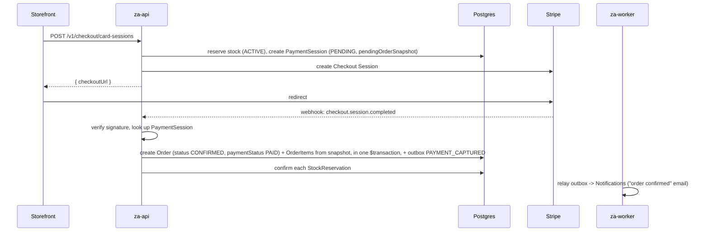

# ADR 0026: Payments

**Status**: Accepted
**Epic**: 12 (Payments & Shipping). Closes the gap [ADR 0015](0015-guest-checkout-and-minimal-order-dependencies.md)
§2/§5 deliberately deferred: "a future Payments epic's migration replaces
two flat enum columns with real `Payment`/`Refund` tables — the flat
columns' values remain meaningful as a summary/cache even after that
normalization." Target domain model was already sketched in
[06-DDD-BOUNDED-CONTEXTS.md](../../06-DDD-BOUNDED-CONTEXTS.md) (`Payment`/
`Refund` entities, `PaymentGatewayPort`, `PaymentAuthorized`/`PaymentCaptured`/
`PaymentFailed`/`PaymentRefunded` events) — this ADR implements that
blueprint against the real Order/Checkout/Inventory/Events code that exists
today, not a green field.
**Reuses**: the transactional outbox and BullMQ/`za-worker` infrastructure
built in [ADR 0023](0023-event-architecture-and-job-system-implementation.md)
— no new event/job mechanism.

## Context

`docs/product/12-PAYMENTS.md`'s acceptance criteria, read in full before
writing any code, set three hard requirements the current flat-column
design cannot satisfy:

1. **"Payment status determined by the gateway's actual recorded outcome,
   never a client-reported one"** — payment status must be settled
   asynchronously, from a webhook, not a redirect callback the customer's
   browser controls.
2. **COD's payment status starts at "awaiting collection," not "paid," and
   only becomes "paid" when Warehouse confirms cash collected at
   delivery.** The current `PlaceOrderUseCase` marks COD orders `PAID`
   immediately at placement — a real, disclosed discrepancy this ADR closes,
   not a design this epic preserves.
3. **`docs/product/07-ORDERS.md`, verbatim**: *"for card payment, an order
   only ever gets created once payment has actually succeeded... Card
   payment fails or is abandoned mid-checkout: no order is ever created...
   There is no 'failed order' record cluttering anyone's view."* This is
   the single hardest constraint: the existing `PlaceOrderUseCase` is one
   synchronous call that reserves stock **and** creates the `Order` in the
   same request. A card flow needs to reserve stock and start a payment
   session in one request, then create the `Order` — or not — from a
   **separate**, later webhook request.

### Why this necessarily touches frozen `orders`/`checkout` modules

Per this epic's own rule ("stop and explain why before changing a frozen
module"): three additive changes to Orders are required, all backward
compatible with every existing COD call site, and are made here rather than
paused on, since the epic's explicit scope is precisely "complete payment
lifecycle integration":

- **`OrderRepository` gains one new method**, `updatePaymentStatus(orderId,
  status, note, actor)`. `changeStatus`'s existing `options.paymentStatus`
  bag only fires alongside an order-status *transition*
  (`OrderPolicy.assertValidTransition` requires `from !== to` for every
  legal edge — `CANCELLED`/`RETURNED` are terminal with no outgoing edges,
  not even to themselves). A refund issued after an order is already
  `CANCELLED` has no status transition to piggyback on, so it needs its own
  update path. This method does not replace `changeStatus`'s existing
  `paymentStatus` option — COD/CARD confirmation both still bundle
  `paymentStatus` into a real status transition, unchanged.
- **`Order` gains two additive, nullable relations**: `shippingMethodId`
  (which rate the customer chose at checkout — see
  [ADR 0027](0027-shipping.md)) and back-relations to the new
  `PaymentTransaction`/`PaymentStatusHistory`/`Refund`/`Shipment` tables.
  No existing column changes type or meaning.
- **`PaymentStatus` enum gains two values**: `AWAITING_COLLECTION` (COD's
  real starting state) and `PARTIALLY_REFUNDED`. `PENDING`/`PAID`/`FAILED`/
  `REFUNDED` keep their exact existing meaning — this is the "flat columns
  become a denormalized summary/cache" compatibility ADR 0015 §5 already
  pre-authorized, not a breaking rename.

`PlaceOrderUseCase` itself is **not** modified for the COD path — it
already creates the `Order` then immediately calls `changeStatus` in one
method (`PENDING` → `CONFIRMED`, `paymentStatus: PAID` today, now
`AWAITING_COLLECTION`). The CARD path is a **new**, separate use-case
(`InitiateCardCheckoutUseCase`) that never calls `OrderRepository.create()`
at all until a webhook confirms success — see "Card flow" below.

## Decision

### Provider abstraction

```ts
export interface PaymentProviderPort {
  readonly provider: PaymentProvider; // 'COD' | 'STRIPE' | 'MANUAL'
  createSession(input: CreateSessionInput): Promise<CreateSessionResult>;
  verifyWebhookSignature(rawBody: Buffer, signatureHeader: string): boolean;
  parseWebhookEvent(rawBody: Buffer): PaymentWebhookEvent;
  refund(input: RefundInput): Promise<RefundResult>;
}
```

Three adapters, selected by `Order.paymentMethod`/checkout input, injected
via a `PAYMENT_PROVIDER_REGISTRY` map (provider key → implementation) rather
than a single injected instance — mirrors how `NotificationsModule` picks a
template by event type, not a new pattern:

- **`CodPaymentProvider`** — `createSession()` is a no-op returning
  `{ requiresRedirect: false }` (checkout proceeds synchronously, exactly
  today's flow); `refund()` returns `{ method: 'STORE_CREDIT', requiresManualFollowUp: true }`
  since there is no electronic transaction to reverse (`docs/product
  /12-PAYMENTS.md`'s explicit COD-refund rule).
- **`StripePaymentProvider`** — `createSession()` creates a real Stripe
  Checkout Session (`stripe.checkout.sessions.create`) and returns its
  `url` for the storefront to redirect to; `verifyWebhookSignature()` uses
  Stripe's SDK (`stripe.webhooks.constructEvent`) against `STRIPE_WEBHOOK_SECRET`;
  `refund()` calls `stripe.refunds.create`.
- **`ManualPaymentProvider`** — for the "Manual Payment Verification"
  scope item: staff manually flips a `PaymentTransaction` from `PENDING` to
  `SUCCEEDED` (bank transfer, cash at a physical counter — no gateway to
  poll). Reused as the same code path Warehouse uses to confirm COD cash
  collected: COD's "mark collected" action *is* a manual payment
  verification, not a separate mechanism.

### COD flow (unchanged request shape, corrected payment-status semantics)

`PlaceOrderUseCase` is unchanged in structure. Only the `changeStatus`
call's `paymentStatus` argument changes: `PAID` → `AWAITING_COLLECTION`.
A new `VerifyManualPaymentUseCase`, called from the admin "mark cash
collected" action (bundled with the existing `AdvanceOrderStatusUseCase`'s
`SHIPPED → DELIVERED` transition, or standalone), calls the new
`OrderRepository.updatePaymentStatus(orderId, PAID, ...)` and writes a
`PaymentTransaction` (type `CAPTURE`, provider `COD`) + `PaymentStatusHistory`
row + outbox event `PAYMENT_CAPTURED`.

### Card flow (new — the "no order until payment succeeds" path)



`PaymentSession` (new table) holds everything `PlaceOrderUseCase` normally
computes in one request, because for card there are now two requests
separated by an arbitrary amount of time on Stripe's hosted page:

```prisma
model PaymentSession {
  id                   String   @id @default(cuid())
  storeId              String
  provider             PaymentProvider
  status               PaymentSessionStatus @default(PENDING) // PENDING|SUCCEEDED|FAILED|EXPIRED
  providerSessionId    String?  // Stripe Checkout Session id
  pendingOrderSnapshot Json     // cart items + reservation ids + address + totals — see below
  orderId              String?  @unique // set once materialized
  amount               Decimal  @db.Decimal(12, 2)
  currencyCode         String   @default("IQD")
  expiresAt            DateTime
  createdAt            DateTime @default(now())
  updatedAt            DateTime @updatedAt
}
```

`pendingOrderSnapshot` is exactly the input `PlaceOrderUseCase` already
assembles before calling `orders.create()` today (customer/address
snapshot, priced line items, each already carrying its `stockReservationId`,
computed `subtotal`/`shippingFee`/`total`) — reusing the same shape, not a
new one. **`InitiateCardCheckoutUseCase`** does steps 1–3 of
`PlaceOrderUseCase` (validate cart, create reservations, snapshot pricing)
verbatim via the same shared helper `PlaceOrderUseCase` already has
internally (extracted, not duplicated), then diverges: instead of calling
`orders.create()`, it writes a `PaymentSession` and calls
`StripePaymentProvider.createSession()`.

The webhook handler (`POST /v1/payments/webhooks/stripe`, `@Public()`,
signature-verified, **idempotent** — a duplicate Stripe retry is a no-op
because it checks `PaymentSession.status` first) is
**`ConfirmCardPaymentUseCase`**: materializes the `Order`/`OrderItem` rows
from the snapshot, creates them at `status: CONFIRMED` directly (not
`PENDING → CONFIRMED` — per `docs/product/07-ORDERS.md`, "a card order
effectively starts at Confirmed"), confirms every reservation, writes a
`PaymentTransaction` + outbox `PAYMENT_CAPTURED`, and links
`PaymentSession.orderId`.

A failed/expired Stripe session (`checkout.session.expired`,
`payment_intent.payment_failed`) is handled by **`FailCardPaymentUseCase`**:
releases every reservation listed in the snapshot via the existing
`ReleaseStockReservationUseCase` directly (no `Order`/`CancelOrderUseCase`
involved — there is no order to cancel), marks the `PaymentSession` `FAILED`,
writes a `PaymentTransaction` (type `FAILURE`) + outbox `PAYMENT_FAILED`.
**No new expiry job is needed**: an abandoned session's reservations are
already released by the existing `ExpireStockReservationsUseCase` maintenance
sweep (Epic 11, every 60s) once `StockReservation.expiresAt` passes — the
same TTL mechanism already protecting COD abandonment protects card
abandonment identically. `PaymentSession.expiresAt` is set to match, so a
stale `PENDING` session is cheap to detect/report on but never blocks a
real fix.

### Ledger tables

```prisma
enum PaymentProvider { COD STRIPE MANUAL }
enum PaymentTransactionType { AUTHORIZATION CAPTURE REFUND FAILURE }
enum PaymentTransactionStatus { PENDING SUCCEEDED FAILED }

model PaymentTransaction {
  id                String   @id @default(cuid())
  storeId           String
  paymentSessionId  String?
  orderId           String?
  provider          PaymentProvider
  type              PaymentTransactionType
  status            PaymentTransactionStatus
  amount            Decimal  @db.Decimal(12, 2)
  currencyCode      String   @default("IQD")
  providerReference String?  // Stripe payment_intent/charge id
  failureReason     String?
  createdAt         DateTime @default(now())
}

model PaymentStatusHistory {
  id        String   @id @default(cuid())
  orderId   String
  status    PaymentStatus // reuses the existing enum, +2 values
  note      String?
  actorId   String?
  actorType ActorType @default(SYSTEM)
  createdAt DateTime @default(now())
}
```

`PaymentStatusHistory` mirrors `OrderStatusHistory`'s exact shape
(append-only, actor-attributed) deliberately — per `docs/product
/12-PAYMENTS.md`, "payment status tracked separately from order status,"
so it gets its own timeline, not a repurposing of `OrderStatusHistory`.

### Refunds

```prisma
enum RefundStatus { PENDING COMPLETED FAILED }

model Refund {
  id                   String   @id @default(cuid())
  storeId              String
  orderId              String
  paymentTransactionId String?
  amount               Decimal  @db.Decimal(12, 2)
  reason               String
  status               RefundStatus @default(PENDING)
  method                String  // "STRIPE" | "STORE_CREDIT"
  requestedByActorId   String?
  requestedByActorType ActorType @default(SYSTEM)
  completedAt          DateTime?
  createdAt            DateTime @default(now())
}
```

`RefundPolicy.assertRefundable(order)` requires `order.status` be
`CANCELLED` or `RETURNED` — refunds are a consequence of cancellation/return
in this product's model (`docs/product/12-PAYMENTS.md` never describes a
refund independent of one), not an arbitrary balance adjustment. Amount can
be partial or full; `Order.paymentStatus` becomes `PARTIALLY_REFUNDED` or
`REFUNDED` (full, matching the order total) via `updatePaymentStatus`.
Approval gating reuses the **already-seeded** `orders.refund` permission
("Cancel orders and issue refunds" — granted to Super Admin/Manager only,
matching `docs/product/12-PAYMENTS.md`'s rule exactly) rather than adding a
new one; manual COD-collection verification reuses `orders.refund` too, and
Shipping zone/method/rate configuration reuses `settings.manage` (store-wide
config, same reasoning Epic 11 used for staff notification preferences). No
new `Permission` row is seeded by this epic at all. A future "request vs.
approve" two-step refund workflow (Sales/Customer Support may only
*request*, per the product doc) is out of this epic's scope (disclosed
below), matching how Returns' full approval workflow was already disclosed
as future work in ADR 0015.

### Webhook idempotency & "payment succeeds but order fails to finalize"

Per `docs/product/07-ORDERS.md`'s unconditional rule — *"this must never
leave a customer charged with no order to show for it... automatically
triggers a refund and immediately alerts Customer Support"* —
`ConfirmCardPaymentUseCase` wraps `Order`/`OrderItem` creation and
reservation confirmation in one Prisma `$transaction`; if it throws after
Stripe has already captured payment, the **outer** webhook controller
catches, calls `StripePaymentProvider.refund()` directly (bypassing the
normal `RefundPolicy`, since no `Order` exists to gate on) and writes a
`SYSTEM`-actor `FailedJobLog` + a `SYSTEM_PAYMENT_RECONCILIATION_FAILURE`
`Notification` (reusing Epic 11's `FailedJobLogRepository`/system-alert
pattern verbatim) so Customer Support is alerted immediately, per spec.

### Events (extends `EVENT_TYPES` — already reserved by ADR 0023, unwired until now)

`PAYMENT_CAPTURED` and `PAYMENT_FAILED` already exist as string constants in
`domain-events.ts` (added, unused, in Epic 11). This epic adds their
`EventPayloadMap` entries, moves them into `WIRED_EVENT_TYPES`, and adds one
new type, `PAYMENT_REFUNDED`. `DispatchNotificationEventUseCase` gains three
new routing entries: `PAYMENT_CAPTURED` → customer receipt email,
`PAYMENT_FAILED` → no customer email (nothing happened from their
perspective per the product doc — silently logged only),
`PAYMENT_REFUNDED` → customer refund-confirmation email.

## Consequences

- Every payment-status change is now attributable and queryable
  (`PaymentStatusHistory`), closing `docs/product/12-PAYMENTS.md`'s audit
  requirement.
- COD's payment-status semantics are corrected to match the product spec
  (`AWAITING_COLLECTION` until delivery), a real behavior change from
  today's "marked PAID at placement" — disclosed here, not silent.
- Stripe is the one real gateway implemented; `MANUAL` exists for
  COD-cash-collection and is intentionally not a distinct "bank transfer"
  UX — a future epic adding a second real manual method (bank transfer with
  a reference number) extends `ManualPaymentProvider`, not a rewrite.
- Refund approval is single-step (`PAYMENTS_MANAGE` issues and it's final);
  the two-step request→approve workflow `docs/product/12-PAYMENTS.md`
  describes for `Sales`/`Customer Support` is disclosed, deferred future
  work, consistent with how ADR 0015 deferred the Returns approval
  workflow.

## Alternatives Considered

- **Always create the `Order` at `PENDING` for card too, flip to
  `CONFIRMED`/`PAID` on webhook** (the "obvious" pattern used by most
  tutorials) — rejected; contradicts `docs/product/07-ORDERS.md`'s explicit,
  quoted "no order is ever created" rule for failed/abandoned card
  payments. Implementing the popular-but-wrong pattern here would be a
  known, avoidable correctness gap, not a disclosed trade-off.
- **A generic `Order.metadata: Json` bag instead of a typed `PaymentSession`
  table** for pending-checkout state — rejected; a typed table lets
  `RefundPolicy`/admin UI/tests reason about pending vs. materialized
  checkouts directly, and keeps `Order` itself exactly as clean as every
  other frozen module left it.
